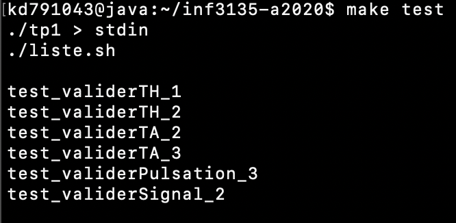

# Travail pratique 1

## Description

Premier travail pratique à faire pour le cours INF3135 de l'UQÀM, session d'autômne 2020.
Le but premier de ce travail est de nous initier à la programmation en C.

## Auteur

Maxime Ouellet (OUEM03019908)

## Fonctionnement

### En utilisant Makefile :

`make lib` : Télécharge ou met à jour les fichiers `tcv.h` et `tcv.o`.

`make` : Produit ou met à jour l'éxécutable `tp1`.

`make test` : Exécute le programme `tp1`.

`make clean` : Réinitialise le projet à son état d'origine.

## Contenu du projet

`.gitignore` : Contient le REGEX des fichiers à ne pas inclure dans le dépôt git.

`Makefile` : Permet de télécharger, produire, réinitialiser et éxécuter le projet.

`cp.txt` : Contient mon code permanent en majuscule.

`liste.sh` : 

`tp1.c` : Contient le code source de mon projet.

## Références

## Statut

## Autoévaluation

