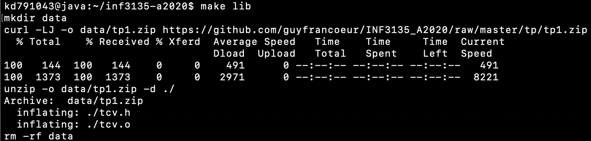
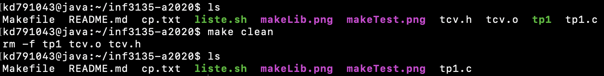

# Travail pratique 1

## Description

Le but premier de ce travail est de nous initier à la programmation en C. Dans ce travail, nous devrons implémenter les différentes fonctions qui testeront les fonctions présentes dans un programme C déjà compilé en fichier objet. Premier travail pratique à faire pour le cours INF3135 de l'UQÀM, session d'autômne 2020.

## Auteur

Maxime Ouellet (OUEM03019908)

## Fonctionnement

### En utilisant le fichier Makefile :

`make lib` : Télécharge ou met à jour les fichiers `tcv.h` et `tcv.o`.

`make` : Produit ou met à jour l'éxécutable `tp1`.

`make test` : Exécute le programme `tp1`.

`make clean` : Réinitialise le projet à son état d'origine.

## Contenu du projet

`.gitignore` : Contient le REGEX des fichiers à ne pas inclure dans le dépôt git.

`Makefile` : Permet de télécharger, produire, réinitialiser et éxécuter le projet.

`cp.txt` : Contient mon code permanent en majuscule.

`liste.sh` : Script bash qui affiche les noms des fonctions qui sont valides et fonctionnelles.

`tp1.c` : Contient le code source de mon projet.

## Références

Aucune source à spécifier.

## Statut

Complété et fonctionnel. Quelques ajustements à faire.

## Réponses

### Q1 : Les valeurs décimales sont nocives pour l'ordinateur, pourquoi ?

### Q2 : Vous devez respecter les limites des types de données, pourquoi ?

Parce que chaque type est un certain nombre de bits, et si on dépasse la capacité de représentation de ce nombre, alors il fera un tour de boucle puis recommencera à 0. Par exemple, si on prend une variable de type char non-signé, la variable est sur 8 bits et donc sa capacité de représentation = 2^8 = 256. Si on entre la valeur 300 dans cette variable, après avoir atteint 256, la variable va faire un tour de boucle et retourner à 0, avant d'ajouter le reste de la valeur. Ainsi, la valeur réellement affectée sera 300 - 256 = 44.

## Autoévaluation

### Fonctionnabilité :

Les tests sont lancés et sont fonctionnels. Ils testent la totalité des restrictions des différentes fonctions. 3.0/3.0

### Bash :

Le script bash liste tous les noms des fonctions dont les tests passent en entièreté. 1.0/1.0

### Compilation :

Il n'y a aucun avertissement ou erreur lors de la compilation et de l'exécution du projet. 1.0/1.0

### Récupération :

La récupération du projet est sans problème et le dépôt est privé. 1.0/1.0

### Branche (git) :

La branche est une branche de développement nommée testunitaire. 1.0/1.0

### Makefile :

Le fichier Makefile offre les quatres services demandés. 2.0/2.0

### Markdown :

Le fichier README est de type markdown et bien structuré. 0.5/0.5

### Professionnel : 

Le projet est simple, organisé et compréhensible. 0.5/0.5

